<div align="center">
  
</div>

---

## 👋 About Me

- 🎓 **B.Tech CSE (AI)** — KIET Group of Institutions, Ghaziabad  
- 📊 **BS Data Science** — IIT Madras  
- 🧠 Engineering-focused **Machine Learning + Full-Stack Developer**
- 🔧 Strong in **Java, Spring Boot, Backend Systems**
- ☁️ **AWS Certified Cloud Practitioner**
- 🚀 Interested in scalable systems, APIs, ML integration & cloud

---

## ⚙️ Tech Arsenal

<div align="center">

<table>
<tr>
<td width="50%">

### Backend & Systems


### ML / Data


### Cloud & DevOps


</td>

<td width="50%">


</td>
</tr>
</table>

</div>

---

## 📈 GitHub Activity

<div align="center">


<br><br>


</div>

---

## 📊 Weekly Development Breakdown

<!--START_SECTION:waka-->

```txt
Total Time: 0 secs

No activity tracked
```

<!--END_SECTION:waka-->

---

## 🏅 Certifications

<div align="center">


</div>

---

## 🔗 Connect

<div align="center">

[](https://www.linkedin.com/)
[]

</div>

---

<div align="center">

_“Engineering is not about tools — it’s about thinking.”_

</div>
