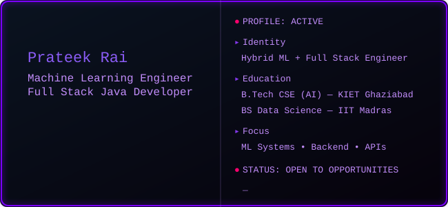

<div align="center">




<a href="https://github.com/Prat260104">

</a>

</div>

<br>

```bash
prateek@systems:~$ cat status.log
[OK]  Google Summer of Code 2026 -- InVesalius 
[OK]  Open Source Contributor -- CNCF , K8s , GSoC , LFX
[OK]  Technical Lead -- NextGen Supercomputing Club, KIET
prateek@systems:~$ _
```

<br>

## `$ cat about.md`

```yaml
role:       AI/ML & Full Stack Hybrid Engineer
building:    distributed systems, AI-integrated backends, open-source infra
education:
  - B.Tech, CS (AI specialization) @ KIET Group of Institutions   | 2024 - 2028
  - BS, Data Science @ IIT Madras                                  | 2024 - 2028
focus:       Java/Spring Boot backends, systems design, applied AI/ML, OSS, fastApi, django, Gen AI
```

<br>

## `$ ./run experience.sh`

<table>
<tr>
<td width="100%">

### 🩻 Google Summer of Code 2026 — InVesalius 
<sub><i>Open Source Software Engineer · May 2026 – Sept 2026</i></sub>

- Designed and shipped a full **.3MF export/import pipeline**, extending InVesalius's pubsub dispatcher to support the 3D-manufacturing format used by OrcaSlicer, PrusaSlicer, and Bambu Studio
- Engineered **bidirectional LPS ↔ Z-up coordinate transforms** with vectorized NumPy — no per-element loops, tested on meshes up to 5M triangles
- Built multi-surface export with per-vertex RGBA color mapping via the `lib3mf` ColorGroup API, scalar normalization, and safe fallback handling
- Wrote CI-grade unit tests (geometry round-trips at 1e-5mm tolerance) validated across macOS, Linux, and Windows
- **20+ merged PRs** — UI thread race-condition fix, VTK SSAO rendering integration, DICOM metadata extraction, multi-object UI workflows

</td>
</tr>
<tr>
<td width="100%">

### 🛰️ Open Source Contributor — CNCF , K8s , GSoC , LFX <sub>(CNCF)</sub>
<sub><i>Jun 2025 – Present</i></sub>

- Building **E2E crash-recovery tests** for a distributed replication system — validating satellite nodes resume layer-level sync after mid-replication failure with zero redundant re-replication
- Writing E2E coverage for **SPIFFE/SPIRE zero-trust registration** (join-token, x509pop, sshpop), including crash-during-handshake paths with no prior coverage
- Verifying fault-tolerant, idempotent replication across backends in **Go**

</td>
</tr>
<tr>
<td width="100%">

### 🧑‍🏫 Technical Lead — NextGen Supercomputing Club, KIET
<sub><i>Nov 2025 – Present</i></sub>

- Leading technical mentorship for 20+ students on backend systems, REST API design, and ML/CV
- Running sessions on DSA and system design for competitive programming prep

</td>
</tr>
</table>

<br>

## `$ ls projects/`

<table>
<tr>
<td width="50%" valign="top">

**⚡ Skill Loop** — *Distributed Skill Exchange Platform*
[`GitHub →`](https://github.com/Prat260104)

Horizontally scalable microservices backend — Spring Boot (Java 21) for auth/profile/session orchestration, FastAPI for AI evaluation. Token-bucket rate limiting, JWT refresh rotation, indexed PostgreSQL access layer designed for stateless horizontal scale. AI skill evaluator running RAG (LangChain + ChromaDB) for live technical interviews over WebSockets, with HuggingFace transformer sentiment analysis on session feedback.

`Java` `Spring Boot` `FastAPI` `PostgreSQL` `LangChain` `ChromaDB` `WebSockets`

</td>
<td width="50%" valign="top">

**🧊 .3MF Export/Import Pipeline** — *InVesalius (pre-GSoC proof of concept)*
[`GitHub →`](https://github.com/Prat260104)

Prototype proving full .3MF export with per-vertex RGBA via the `lib3mf` ColorGroup API and correct geometry orientation, built to validate feasibility before the GSoC coding period. NumPy-vectorized LPS→Z-up transform via `vtk_to_numpy()`, with ColorGroup/TriangleProperties XML validated for slicer compatibility.

`Python` `NumPy` `VTK` `lib3mf`

</td>
</tr>
</table>

<br>

## `$ cat stack.json`

<div align="center">

**Languages**
<br>


**Backend & Systems**
<br>


**ML / AI (Applied)**
<br>


**Cloud & DevOps**
<br>


</div>

<br>

## `$ cat certifications.md`

- 🎓 **AWS Certified AI Practitioner** — Amazon Web Services
- 🎓 **AWS Certified Cloud Practitioner** — Amazon Web Services
- 🎓 **Foundations of Programming and Data Science** — IIT Madras

<br>

## `$ curl stats/`

<div align="center">


<br>


<br><br>


</div>

<!--
  Optional: animated contribution snake — add .github/workflows/snake.yml (provided alongside this
  file) and this repo will auto-generate a dark/light snake SVG on a schedule. Once it's live, swap
  the img below in for the graph above, or place it underneath.

<picture>
  <source media="(prefers-color-scheme: dark)" srcset="https://raw.githubusercontent.com/Prat260104/Prat260104/output/github-contribution-grid-snake-dark.svg" />
  
</picture>
-->

<br>

## `$ ./connect.sh`

<div align="center">

<a href="https://www.linkedin.com/in/prateek-rai">
  
</a>
<a href="https://github.com/Prat260104">
  
</a>
<a href="mailto:prateekrai903@gmail.com">
  
</a>

<br><br>


</div>

<br>

<div align="center">


<sub><i>strong systems outlive fancy dashboards.</i></sub>

</div>
