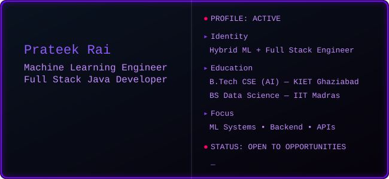

<div align="center">




<br>

<a href="https://github.com/Prat260104">

</a>

</div>

<br>

---

## `$ whoami`

```yaml
name: Prateek Rai
role: AI/ML & Full-Stack Engineer

focus:
  - Backend & Distributed Systems
  - Go & Cloud Native
  - AI/ML & Generative AI
  - UI/UX & Web Engineering
  - Open Source
```

Building **production-oriented systems** across backend infrastructure, AI/ML, cloud-native engineering, and modern web experiences.

Currently contributing across the **CNCF, Kubernetes ecosystem, GSoC, and LFX**, with a focus on **AI/ML, Go, distributed systems, testing, and reliability**.

---

## `$ cat status.log`

```text
[OK] GSoC 2026 — InVesalius
[OK] CNCF / Kubernetes / LFX — Open Source
[OK] Go — Distributed Systems & Cloud Native
[OK] Technical Lead — NextGen Supercomputing Club
```

---

## `$ cat education.md`

**B.Tech — CSE (AI)** · KIET Group of Institutions · 2024–2028
**BS — Data Science** · IIT Madras · 2024–2028

---

# `$ ./run experience.sh`

###  Google Summer of Code 2026 — InVesalius

**Open Source Software Engineer · May–Sept 2026**

Open-source medical imaging and visualization engineering.

* Built a complete **`.3MF` import/export pipeline**
* Implemented **LPS → Z-up coordinate transformations** with NumPy
* Added **per-vertex RGBA mapping** using `lib3mf`
* Extended pubsub workflows for 3D manufacturing
* Added geometry/export validation and CI-grade tests
* Worked across **Python · NumPy · VTK · DICOM**
* **20+ merged PRs**

###  LFX / CNCF / Kubernetes

**Go Developer · Distributed Systems · Jun 2025–Present**

* Building **E2E crash-recovery tests** for distributed replication
* Validating synchronization after mid-replication failures
* Testing **fault-tolerant, idempotent replication**
* Production-oriented testing and tooling in **Go**

`Go` `Distributed Systems` `Kubernetes` `CNCF` `E2E`

# `$ cat stack.json`

### Languages

<p>


</p>

### Backend · Cloud · AI

<p>


</p>

<p>


</p>

### Frontend · UI/UX

<p>


</p>

### DevOps

<p>


</p>

---

# `$ cat certifications.md`

**AWS Certified AI Practitioner** · AWS
**AWS Certified Cloud Practitioner** · AWS
**Foundations of Programming & Data Science** · IIT Madras

---

# `$ curl stats/`

<div align="center">


<br>


<br><br>


</div>

<br>

<picture>
  <source media="(prefers-color-scheme: dark)" srcset="https://raw.githubusercontent.com/Prat260104/Prat260104/output/github-contribution-grid-snake-dark.svg" />
  
</picture>

---

# `$ ./connect.sh`

<div align="center">

<a href="https://www.linkedin.com/in/prateek-rai-969136342">

</a>

<a href="https://github.com/Prat260104">

</a>

<a href="mailto:prateekrai903@gmail.com">

</a>

<br><br>


</div>

<br>

<div align="center">


<sub><i>strong systems outlive fancy dashboards.</i></sub>

</div>
